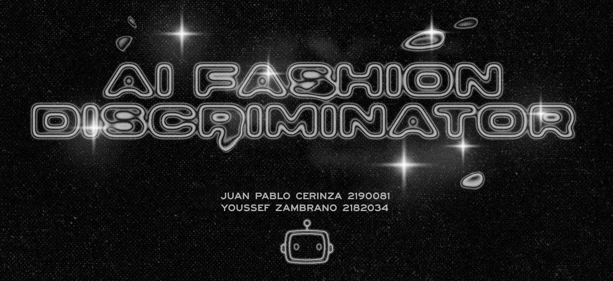

# AI Fashion Discriminator 2.0

### Presentation
[https://drive.google.com/file/d/1JL-r1kclfqF4TcKCoUbMzCz8ZpZbHdkx/view?usp=share_link
](https://docs.google.com/presentation/d/19G4Tq4fX-TgeF9Vx9-vt5R-xQca2vK4S5rselOr5Jfg/edit?usp=sharing)
### Dataset description
It consists of nearly 100 images of men and women wearing clothes that belong to 5 different styles (Sportswear, Fancy, Streetwear, Preppy, Techwear).

### Objective
AI Fashion Discriminator's objective is to guide the user to dress up in the style they so desire, by telling them the style their current outfit belongs to.

### Models
There are three models within this project, 1 of them follows a tree-like structure, the other two are multiclass discriminators, powered by CNN, however, one of them does not use the processed dataset.

