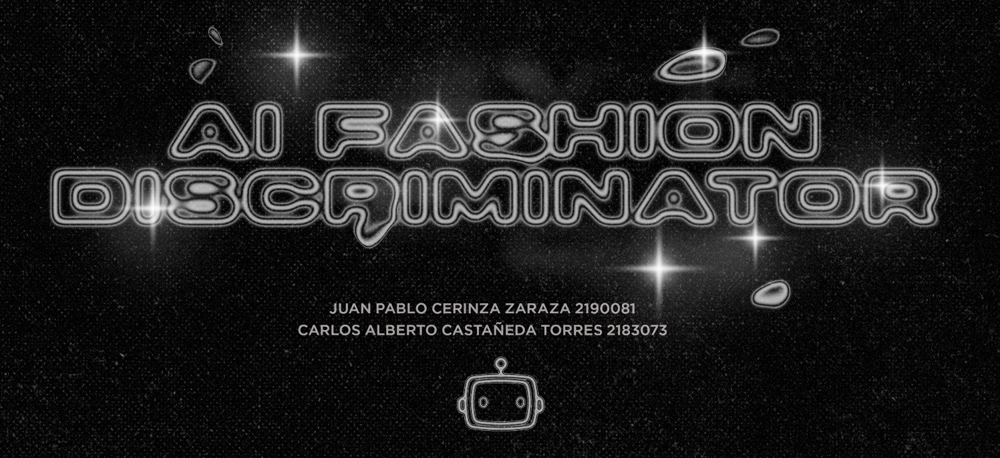

# AI Fashion Discriminator

### Presentación
https://drive.google.com/file/d/1JL-r1kclfqF4TcKCoUbMzCz8ZpZbHdkx/view?usp=share_link

### Video 
https://youtu.be/RCLCmu3NwjU

### Objetivo
El objetivo de AI Fashion Discriminator es ayudar a las personas a tomar mejores decisiones en el ámbito de la moda, diciéndole al usuario si aquello que viste va a la moda o no

### Estimadores
Se implementó CNN con 3 capas Conv2D, 2 MaxPooling2D, 1 Dense y Output layer. Con un total de 1.127.105 trainable params.

